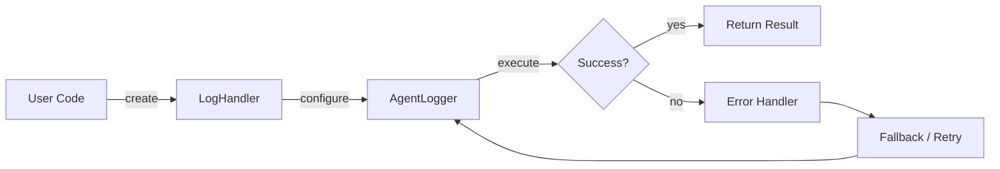
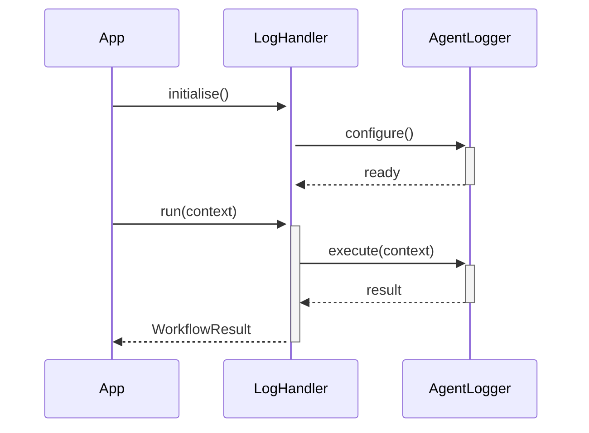

<div align="center">

</div>

# agent-log

**Structured JSON logging for LLM agents — zero dependencies.**

[](https://pypi.org/project/agent-log/) [](https://python.org) [](LICENSE) [](#)

---

## The Problem

Without structured logging, debugging distributed agents means grepping unstructured text — slow, brittle, and impossible to aggregate. A missing `context_id` field in production means hours of manual log archaeology per incident.

## Installation

```bash
pip install agent-log
```

## Quick Start

```python
from agent_log import LogHandler, AgentLogger, InMemoryHandler

# Initialise
instance = LogHandler(name="my_agent")

# Use
# see API reference below
print(result)
```

## API Reference

### `LogHandler`

```python
class LogHandler(ABC):
    """Base handler; subclasses implement emit()."""
    def __init__(self, level: str = "DEBUG") -> None:
    def level(self) -> str:
    def level(self, value: str) -> None:
    def handle(self, record: LogRecord) -> None:
        """Pass *record* to emit() if its level meets the threshold."""
```

### `AgentLogger`

```python
class AgentLogger:
    """
    def __init__(
    def add_handler(self, handler: LogHandler) -> None:
    def remove_handler(self, handler: LogHandler) -> None:
    def bind(self, **fields) -> "AgentLogger":
        """Return a new logger with *fields* always attached to every record."""
```

### `InMemoryHandler`

```python
class InMemoryHandler(LogHandler):
    """Stores up to *max_size* records in memory."""
    def __init__(self, level: str = "DEBUG", max_size: int = 1000) -> None:
    def records(self) -> list[LogRecord]:
        """All stored records (read-only view)."""
    def emit(self, record: LogRecord) -> None:
    def filter(
```


## How It Works

### Flow



### Sequence



## Philosophy

> The *Akashic records* hold all that has transpired; a structured log is their computational equivalent.

---

*Part of the [arsenal](https://github.com/darshjme/arsenal) — production stack for LLM agents.*

*Built by [Darshankumar Joshi](https://github.com/darshjme), Gujarat, India.*
