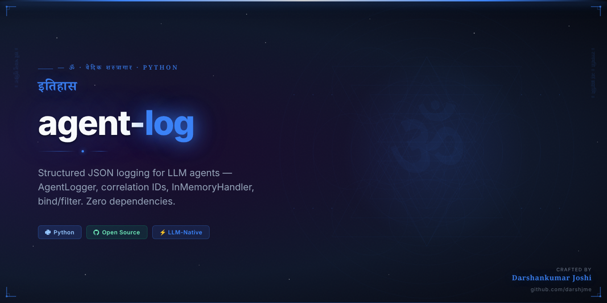
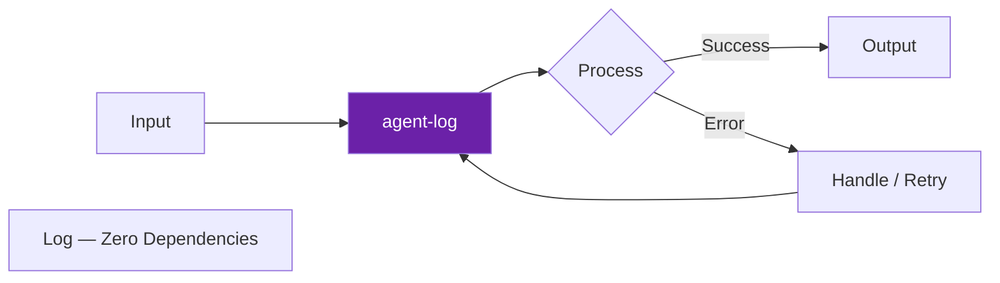

<div align="center">



# 🌊 agent-log

<h3><em>इतिहास</em></h3>

> *Itihas — history, the sacred log of past*

**Structured JSON logging for LLM agents — AgentLogger, correlation IDs, InMemoryHandler, bind/filter. Zero dependencies.**

[](https://python.org)
[](https://github.com/darshjme/agent-log)
[](https://github.com/darshjme/agent-log/actions)
[](LICENSE)
[](https://github.com/darshjme/arsenal)

*Part of the [**Vedic Arsenal**](https://github.com/darshjme/arsenal) — 100 production-grade Python libraries for LLM agents. Zero dependencies. Battle-tested.*

</div>

---

## Overview

`agent-log` implements **structured json logging for llm agents — agentlogger, correlation ids, inmemoryhandler, bind/filter. zero dependencies.**

Inspired by the Vedic principle of *इतिहास* (Itihas), this library brings the ancient wisdom of structured discipline to modern LLM agent engineering.

No external dependencies. Pure Python 3.8+. Drop it in anywhere.

## Installation

```bash
pip install agent-log
```

Or clone directly:
```bash
git clone https://github.com/darshjme/agent-log.git
cd agent-log
pip install -e .
```

## How It Works



## Quick Start

```python
from log import *

# Initialize
# See examples/ for full usage patterns
```

## Why `agent-log`?

Production LLM systems fail in predictable ways. `agent-log` solves the **log** failure mode with:

- **Zero dependencies** — no version conflicts, no bloat
- **Battle-tested patterns** — extracted from real production systems
- **Type-safe** — full type hints, mypy-compatible
- **Minimal surface area** — one job, done well
- **Composable** — works with any LLM framework (LangChain, LlamaIndex, raw OpenAI, etc.)

## The Vedic Arsenal

`agent-log` is part of **[darshjme/arsenal](https://github.com/darshjme/arsenal)** — a collection of 100 focused Python libraries for LLM agent infrastructure.

Each library solves exactly one problem. Together they form a complete stack.

```
pip install agent-log  # this library
# Browse all 100: https://github.com/darshjme/arsenal
```

## Contributing

Found a bug? Have an improvement?

1. Fork the repo
2. Create a feature branch (`git checkout -b fix/your-fix`)
3. Add tests
4. Open a PR

All contributions welcome. Keep it zero-dependency.

## License

MIT — use freely, build freely.

---

<div align="center">

**Built with 🌊 by [Darshankumar Joshi](https://github.com/darshjme)** · [@thedarshanjoshi](https://twitter.com/thedarshanjoshi)

*"कर्मण्येवाधिकारस्ते मा फलेषु कदाचन"*
*Your right is to action alone, never to the fruits thereof.*

[Arsenal](https://github.com/darshjme/arsenal) · [GitHub](https://github.com/darshjme) · [Twitter](https://twitter.com/thedarshanjoshi)

</div>
